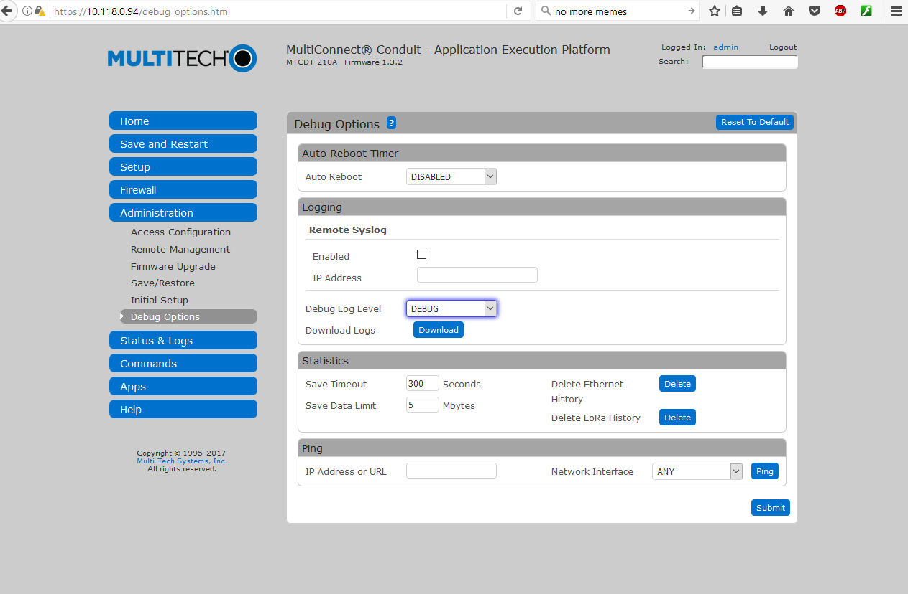
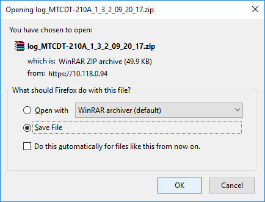
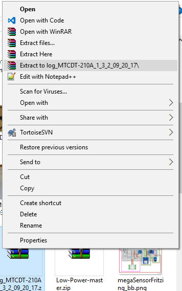
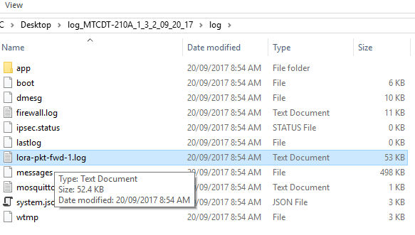
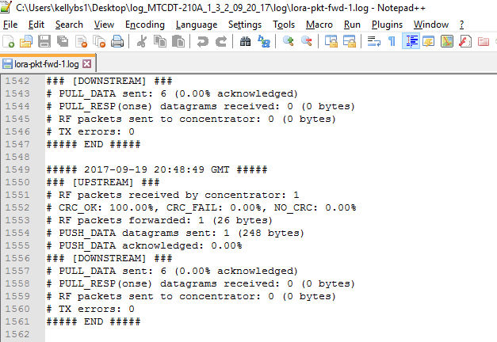

# Accessing the Conduit's Packet Forwarder logs

## Save logs

Log into your Conduit's web interface by typing its IP address in a browser, and entering your username/password when prompted.

In the menu on the left click "Administration" then "Debug Options".

Under "logging" set the "Debug Log Level" dropdown to "DEBUG".

Click the Download button.

You will be prompted to download a zip file. Save the file somewhere convenient.

## Extract logs

On your computer, browse to the location of the file, right click on the file and choose to extract it to a folder.

## Find log file

On your computer, browse to the new folder created by the extraction. The folder name will probably start with "log_MTCDT-210A...".

Inside that folder open the "logs" folder. 

Open the file "lora-pkt-fwd-1.log" with a text editor.

## Read

You should now be able to see the standard packet forwarder output.

   
----------------------------------

