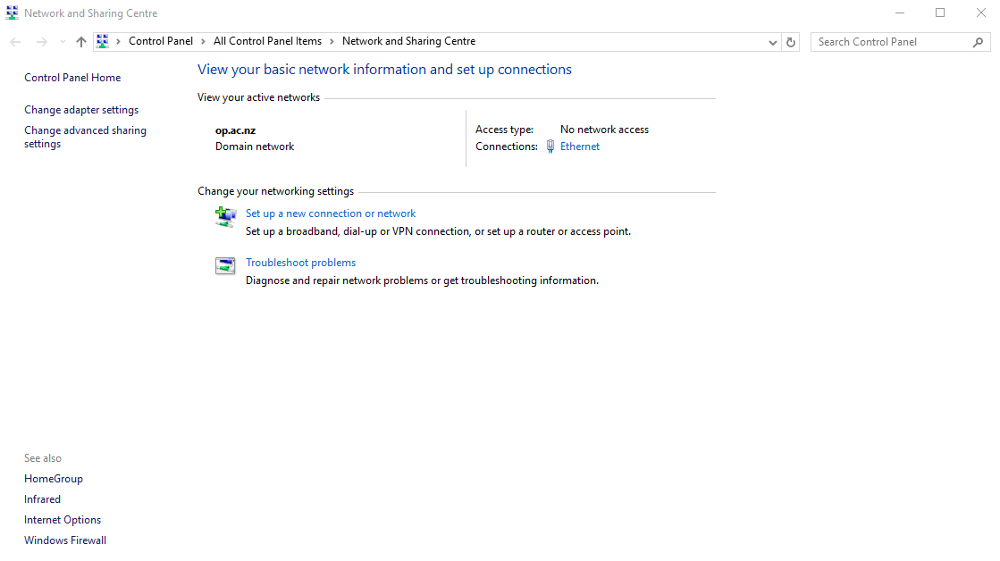
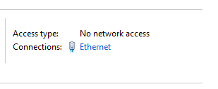
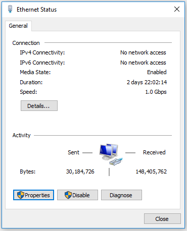
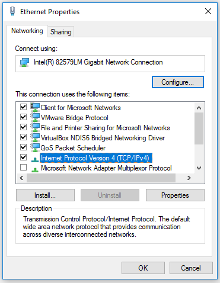
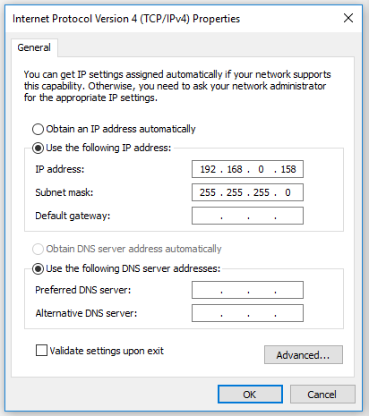

# Changing network settings for locally accessing the Multitech Conduit

If you are experiencing issues with connecting to the multitech gateway locally then you may need to ensure 
you are in the same ip address range.

Right click and choose open Network and Sharing Centre.

This is the screen you will be taken to.

Then click the Ethernet connection.

Then click Properties.

Then double click Internet Protocol Version 4 (TCP/IPv4).

Then the ip address can be set statically.

