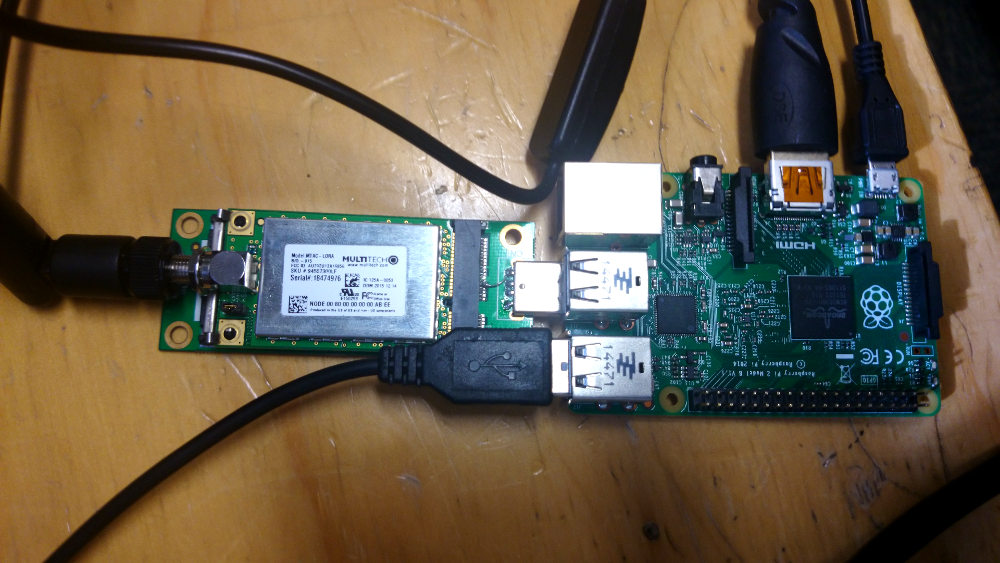
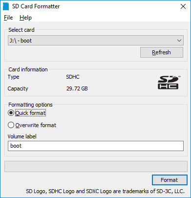
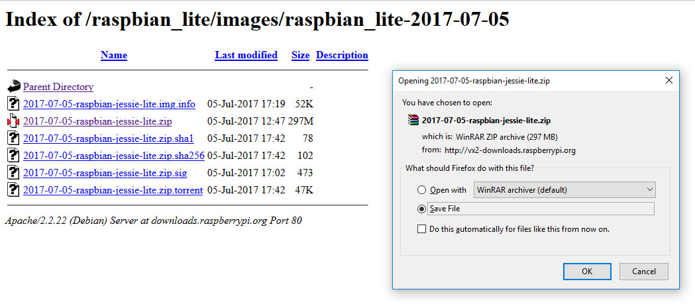
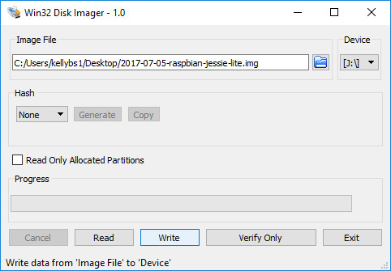
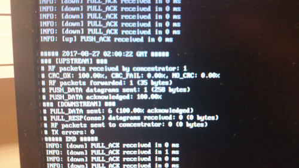

# Raspberry Pi + Lora MCard AU915 Gateway

## Prep

### Installing Raspbian Jessie on a Pi 2:

First, Format SD card FAT32 - On a Windows machine use:

Download SD card formatter: https://www.sdcard.org/downloads/formatter_4/eula_windows/index.html

Follow the tutorial here to install Raspbian Jessie:

https://www.howtoforge.com/tutorial/howto-install-raspbian-on-raspberry-pi/#-downloading-raspbian-and-image-writer

Additional links:

Latest Raspbian Jessie Lite download: http://downloads.raspberrypi.org/raspbian_lite/images/raspbian_lite-2017-07-05/

Win32 Disk Imager: https://sourceforge.net/projects/win32diskimager/

-----------------

## Optional (but probably a good idea)

### Fixing keyboard layout (it's UK by default)

Source: https://www.raspberrypi.org/forums/viewtopic.php?f=28&t=80127

run:

`sudo raspi-config`

(use Tab select select OK/Cancel)

* Choose 4: Localization
* Choose I3: Keyboard setup
* Choose generic 102 keyboard
* Choose Other
* In country of origin menu choose English (US) 
* Then from Keyboard layout menu choose English (US)

## Required

### Enable SSH

Source: https://www.raspberrypi.org/documentation/remote-access/ssh/

While in raspi-config

Go back to main menu

* Select Interfacing Options
* Select P2 SSH
* Choose Yes
* Select OK
* Choose Finish

reboot, eg: `sudo reboot now`

-----------------

## Actually setting up mCard / GateWay now

### Bump the USB power and enable SPI on the Pi

Source: https://github.com/mirakonta/lora_gateway/wiki/Part-2:-Hardware-modifications

"Raspberry-Pi 2 has USB current limiter that could prevent the concentrator to start up correctly" 

`sudo nano /boot/config.txt`

add to this file:

`max_usb_current=1`

add or uncomment:

`dtparam=spi=on`

Reboot

Check SPI working

run:

`ls /dev/spi*`

and the response should be:

`/dev/spidev0.0  /dev/spidev0.1`

### Set up and install libftdi drivers

`sudo apt-get update`

`sudo apt-get install git --assume-yes`

`sudo apt-get install libftdi-dev --assume-yes`

`cd ~`

`wget https://github.com/kellybs1/libmpsse/raw/master/libmpsse-1.3.tar.gz`

`tar zxvf libmpsse-1.3.tar.gz`

`cd libmpsse-1.3/src`

`./configure --prefix=/usr --disable-python`

`make`

`sudo make install`

`sudo udevadm control --reload-rules`

`sudo adduser pi plugdev`

### Set up and install gateway and packetforwarder 

Sources: https://github.com/Lora-net/lora_gateway

https://github.com/Lora-net/packet_forwarder/wiki/Use-with-Raspberry-Pi

`cd ~`

`mkdir lora`

`mkdir ~/lora/exec`

`cd ~/lora`

`git clone https://github.com/kellybs1/lora_gateway.git`

`git clone https://github.com/kellybs1/packet_forwarder.git`

`cd ~/lora/lora_gateway`

`make clean all`

`cd ~/lora/packet_forwarder`

`make clean all`

Copy executable

`cp ~/lora/packet_forwarder/basic_pkt_fwd/basic_pkt_fwd ~/lora/exec/`

### get AU915 DunedinIoT config:

`wget -O ~/lora/exec/global_conf.json https://raw.githubusercontent.com/kellybs1/LoRaConfigs/master/global_conf.json`

### Change gateway ID

`sudo cp ~/lora/packet_forwarder/basic_pkt_fwd/local_conf.json ~/lora/exec/local_conf.json`

`sudo nano ~/lora/exec/local_conf.json`

Good idea to use the MAC address for this as it's unique-ish.

See MAC address by typing `ifconfig`

Change "gateway_ID": 

eg, "gateway_ID": B827EBFFFEE2AF08
					   

### Optional: Change network server address and ports

 (should already be set if using DunedinIoT global config file so may not be necessary)
 
Source: https://github.com/mirakonta/lora_gateway/wiki/Part-5:-LoRaWAN-Network-Server

`sudo nano ~/lora/exec/global_conf.json`

go down to bottom section called "gateway_conf"

Change "server_address", "serv_port_up" and "serv_port_down" as appropriate

-----------------
### Running the gateway

To run gateway:

`cd ~/lora/exec`

`sudo ./basic_pkt_fwd`

-----------------

### Optional:  Save the Pi image

https://thepihut.com/blogs/raspberry-pi-tutorials/17789160-backing-up-and-restoring-your-raspberry-pis-sd-card

-----------------

### Optional: Auto login on Raspbian Jessie

Source: https://www.raspberrypi.org/forums/viewtopic.php?f=28&t=127042

`sudo touch /etc/systemd/system/getty@tty1.service.d/autologin.conf`

and put this in it:

`[Service]`

`ExecStart=`

`ExecStart=-/sbin/agetty --autologin pi --noclear %I 38400 linux`

Then run

`sudo systemctl enable getty@tty1.service`

-----------------
### All Sources:

https://www.sdcard.org/downloads/formatter_4/eula_windows/index.html

https://www.howtoforge.com/tutorial/howto-install-raspbian-on-raspberry-pi/#-downloading-raspbian-and-image-writer

http://downloads.raspberrypi.org/raspbian_lite/images/raspbian_lite-2017-07-05/

https://sourceforge.net/projects/win32diskimager/

https://www.raspberrypi.org/forums/viewtopic.php?f=28&t=80127

https://www.raspberrypi.org/documentation/remote-access/ssh/

https://github.com/mirakonta/lora_gateway/wiki/Part-2:-Hardware-modifications

https://github.com/Lora-net/lora_gateway

https://github.com/Lora-net/packet_forwarder/wiki/Use-with-Raspberry-Pi

https://github.com/mirakonta/lora_gateway/wiki/Part-5:-LoRaWAN-Network-Server

https://thepihut.com/blogs/raspberry-pi-tutorials/17789160-backing-up-and-restoring-your-raspberry-pis-sd-card

https://www.raspberrypi.org/forums/viewtopic.php?f=28&t=127042

https://kuziel.nz/notes/2016/08/lora-gateway-mk1-raspberrypi-multitech-lora-mcard.html
