#  Node-RED flow for the Multitech mDot Box 

After this tutorial you willbe able to see the message send from the mDot Box demo mode.
Go to the devices ip address followed by a colon and the port 1880 by default e.g. 192.168.0.155:1880 is the address for the 
previous tutorial, the port and address may be different depending on what they were configured to.

The default login uses the same credentials as used for the Multitech conduit AEP (Application Execution Platform) login. 
It is recommended to change the username and/or password before deployment.

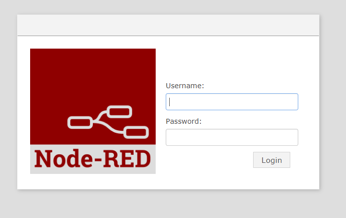

On the left hand side are the inputs, outputs functions, social, storage, analysis and advanced sections

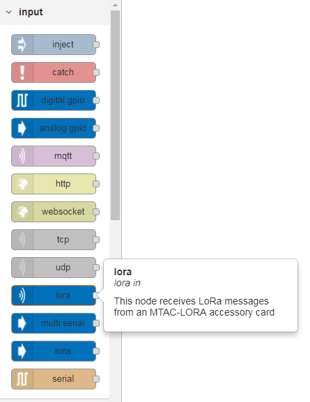

Click and drag the lora input block to the sheet.

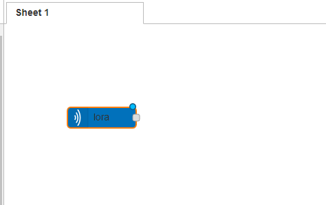

Next click and drag the debug output block to the screen.

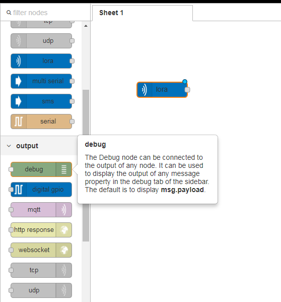

Then click and drag the function block from the functions section.

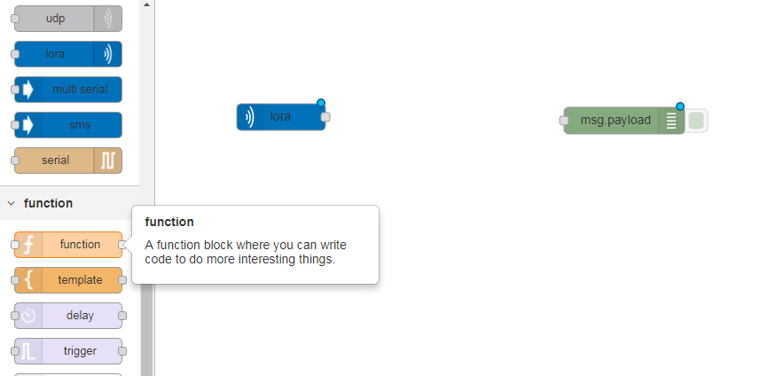

Place it between the previous 2 blocks.
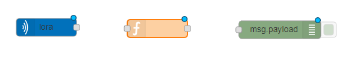

Click and drag the square box beside the lora node and let go over the left side of the function node then link the function 
node to the debug node the same way.

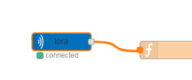          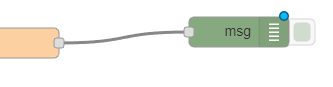

Then double click the function node to edit the function.

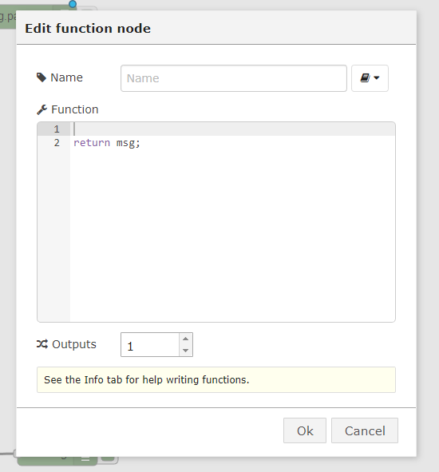

Delete all code in the function section and replace it with the code provided from this url 
(ftp://ftp.multitech.com/mmm/EVBParserLatest.txt ), note that you may nned to save the code as a notepad file first in some 
instances(it can depend on the formatting).  Click ok when finished.

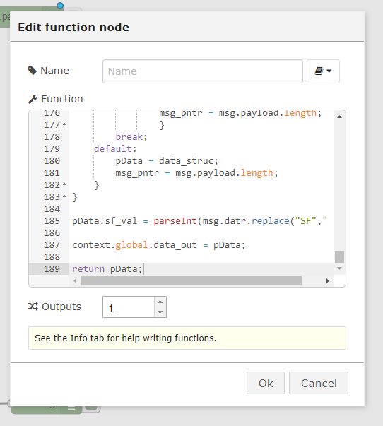

Double click the debug output node and change the output from message property to complete msg object.  Click ok when finished.

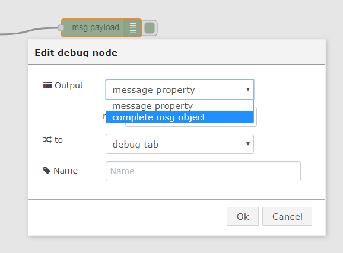

To activate this configuration click the deploy button above the debug section on the top right.

On the mDot Box set the mode to LoRa Demo, the gateway will connect and you can then choose an option on how you want the 
messages to be sent.  Interval or trigger mode.

### Invalid Data
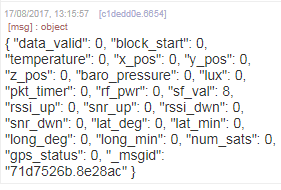

This output in invalid because we need to change the input data type, double click the lora input node to edit it.
Change the data type field from UTF-8 to Bytes.  Click ok then click deploy to apply the changes.

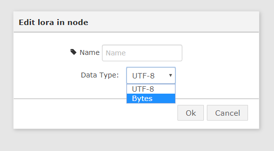

To activate the new configuration click the deploy button.

Now the data is readable.
### Valid Data
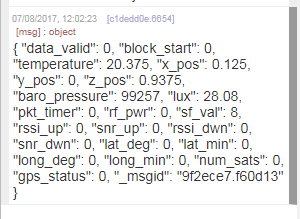

