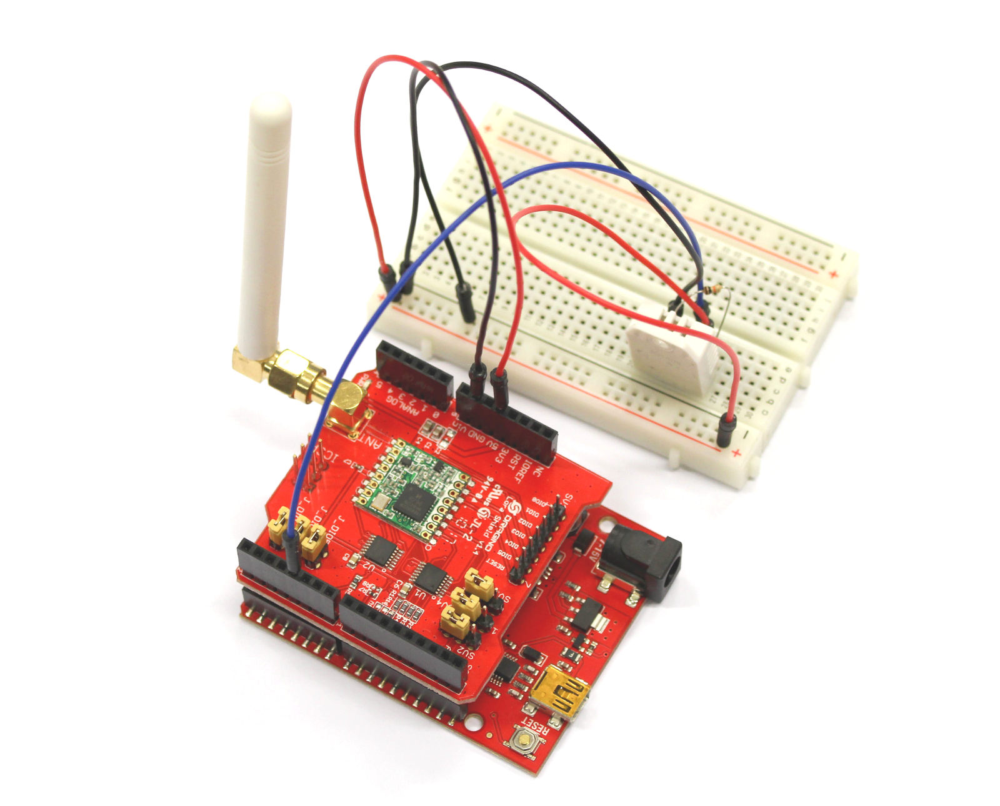
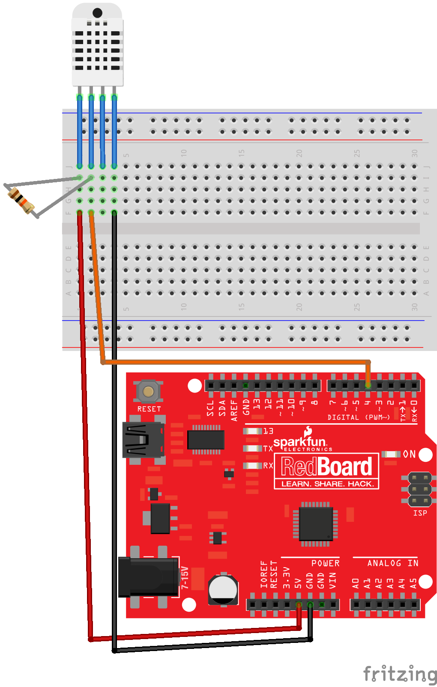

#  Dragino LoRa shield (868MHz) temperature/humidity example for IoT Dunedin server and 868MHz ic880a based gateway

## Hardware required
1. Arduino Uno or compatible
2. Dragino 868Mhz LoRa Arduino shield 
3. 10KOhm resistor

## Additional software libraries
Adafruit DHT library (https://github.com/kellybs1/DHT-sensor-library)

## Wiring

Note: Dragino shield not included in diagram but must be installed
Note: Dragino shield leaves pins 0,1,4,5,6 for use

## Code

<a href ="Dragino868TempHumid.ino">Dragino868TempHumid.ino</a>
