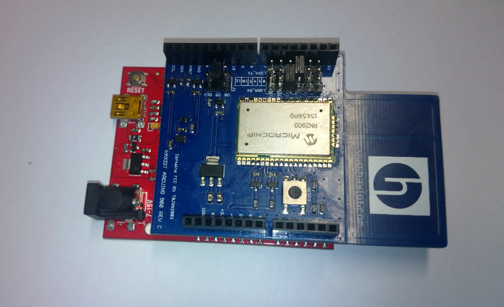

#  Haxiot LoRa shield with Arduino Uno sending test data to hosted Loriot backend

## Hardware required
1. Arduino Uno or compatible
2. Haxiot US900 Arduino Shield (https://haxiot.com/shop/arduino-lorawan-us900/)

## Additional software libraries
<a href="http://haxiot.com/download/11333/">Haxiot Arduino library</a>

## Wiring

None, just install the Arudino shield onto the Arduino board

## Code

<a href ="Haxiot915Test.ino">Haxiot915Test.ino</a>
