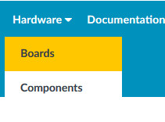
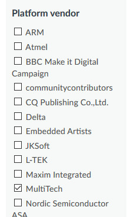
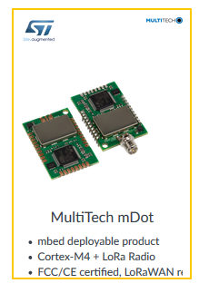
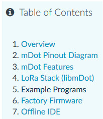
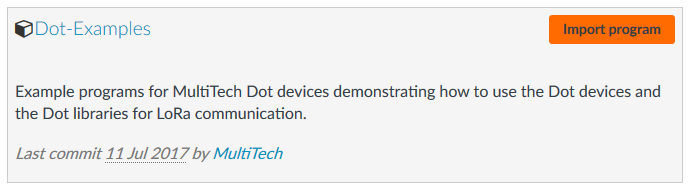
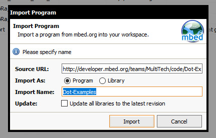
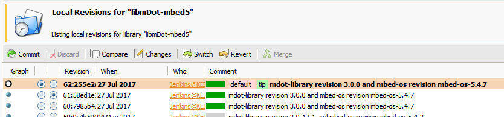
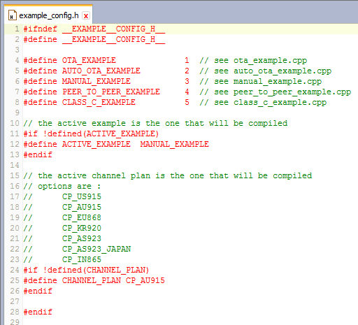
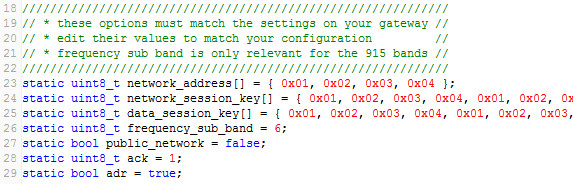
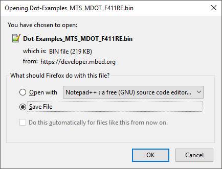

# Getting Started With mDot and https://developer.mbed.org/

## Prep

Create an account at https://developer.mbed.org

Then click Hardware -> Boards.

Filter "platform vendor" by Multitech.

Select mDot.

On the page that loads, on the right, click the "Add to your embed compiler" button.

## Importing example program

Go back to the platform page for the mDot, and find "Example programs".

In the "dot examples box", click the orange "import program" button. 

In the compiler window that opens, click to Import the program.

Back on the platform page, find "lora stack". Scroll down to "libmDot-mbed5" and import the program to the compiler as well.

## Make sure mbedOS and libMDot libraries match

In the compiler program workspace, click on the libMDot-mbed5, then click on the Revision button.

Note the latest version of mbedOS in the comment field (eg 5.4.7).

Then select mbed-os in the program workspace, and select the matching revision. Click switch if it is different.

## Configuring examples

Now in the program workspace click the examples folder, and select example_config.h

This is where you select the example that will be compiled.

For example ota_example is an OTAA example, manual_example is an ABP example.

Change channel plan: the channel plan line should be #define CHANNEL_PLAN CP_AS923

as we want to be using AS923 for our example.

### Configuring example LoRa settings

To set LoRa network settings, select the src folder and open the cpp example file you wish to run.

Set the network name, address, session and data keys as necessary.

Make sure sub band matches your Conduit's settings.

Click save or save all to save changes to the file.

## Building the binary

Click compile.

If you see failure messages, check the platform selection, and the correct versions of LoRa stack 
and embedOS.

Download the .bin file when prompted.

Plug in the devboard with mDot and antenna attached.

The devboard should appear as a USB flash drive would.

Copy the downloaded bin file to the drive.

Press reset on the dev board and the program should run.

## Seeing debug info on a PC over USB

On Windows you must install serial-USB driver from here: http://www.st.com/en/embedded-software/stsw-link009.html

Open a serial terminal. I used the Arduino IDE's serial monitor set to the correct COM port (this varies) at 9600 baud.

Primary source:
https://www.youtube.com/watch?v=w9ixiSduqxo
