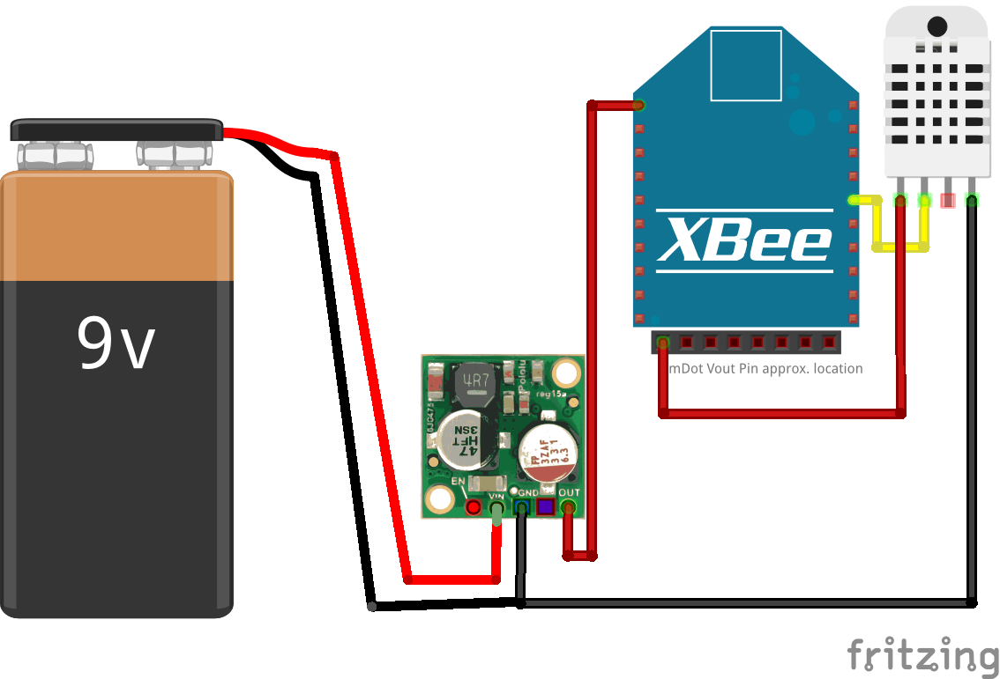
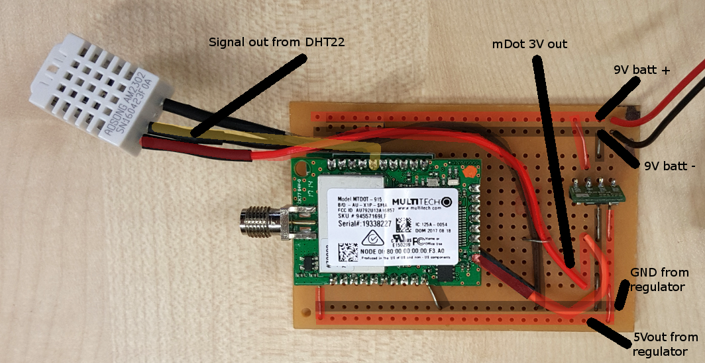
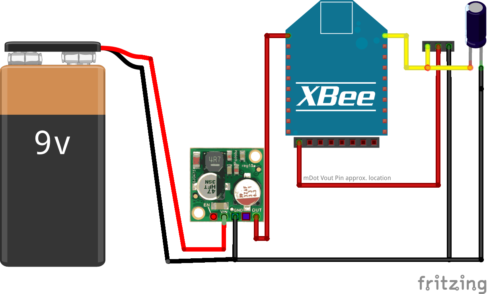
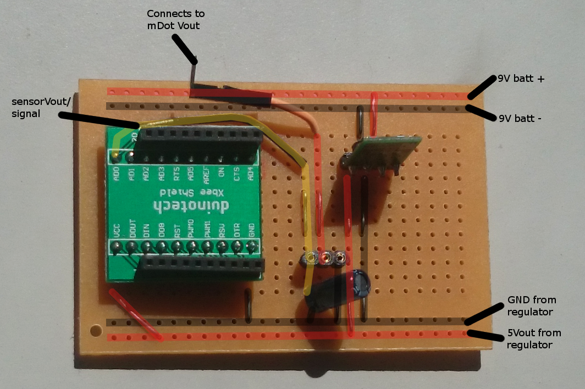

# Basic battery-powered prototype boards

This page provides information and diagrams for two prototype batery powered nodes:

A DHT22-wired node with socket for an mDot and 9V connector

A node with a socket for an mDot and a three-pin socket for attaching any analogue sensor.

## Additional Hardware

Pololu 5V, 500mA Step-Down Voltage Regulator D24V5F5: https://www.pololu.com/product/2843

Arduino-compatible Xbee interface shield: https://www.jaycar.co.nz/arduino-compatible-xbee-interface-shield/p/XC4608

Solder-able prototyping board: 

Misc:

Various wires

solder

soldering iron 

1uF - 10uF capcitor for analogue sensors

Multimeter

## Notes

It is vitally important after soldering the board to test all connections using a quality multimeter.

The following testing was performed:

1. Check conductivity between all connections that should be connected, for example the wires that bridge gaps, and the 5V to mDot Vin.
2. Check non-conductivity between all adjacent connections that shouldn't be connected, for example, 5V rail and ground rail.
3. Attach battery and check 9V going into voltage regulator.
4. Check 5V and ground on voltage regulator out.
5. Check side 5V and ground rail.
6. Check 5V and ground on mDot connection pins.

If all tests pass it is now safe to attach your programmed mDot.

- 

## DHT22 board

This is a board with a hard-wired DHT22 sensor connected to a digital pin on the mDot / Xbee shield.

The basic wiring diagram:

This is an image of the physical implementation of the board, with connected wires highlighted:

## Analogue socket board

This is a board with a three-pin socket allowing attachment of any analogue sensor such as an Light Dependent Resistor or Moisture Sensor.

The basic wiring diagram:

This is an image of the physical implementation of the board, with connected wires highlighted:

