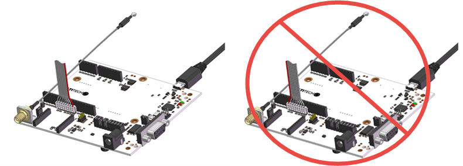
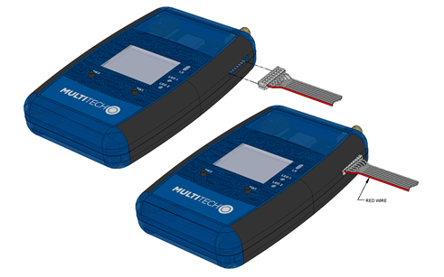
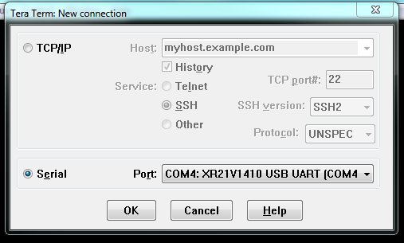
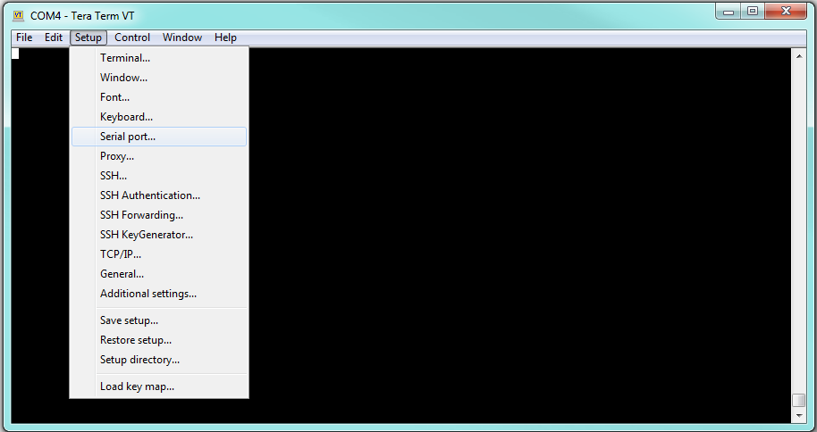
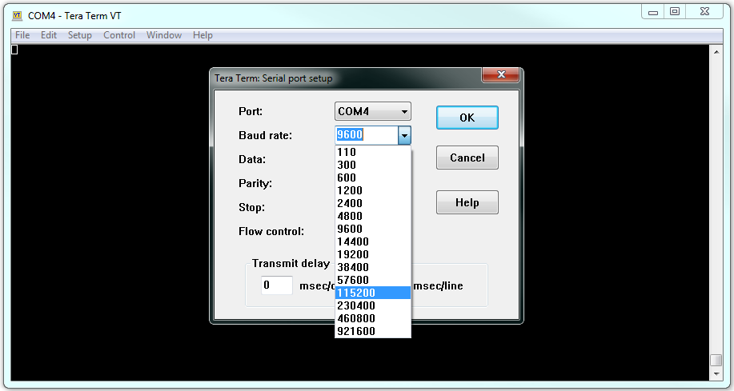
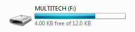
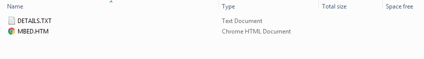
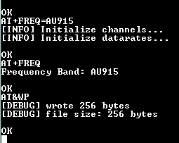
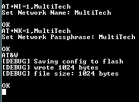

# Connect Multitech mDot Box to gateway
By default, the Multitech mDot Box is setup to work with the US frequency, this and some other settings need to be configured to properly work with the Multitech conduit gateway in New Zealand or Australia.

_Note: The following defaults are not recommended for use as they are not suitable for New Zealand or Australia.  If you do not want to configure the device, configure the gateway to match these device default network parameters:  
•	name: MultiTech  
•	phrase: MultiTech  
•	sub band: 1 (only applies to US/915 MHz Frequency Band)_  
Source: http://www.multitech.net/developer/software/dot-box-and-evb-software/configuration-mode/ 

Before the mDot Box can be configured it needs to be correctly connected to a computer, this is done by using a MultiConnect mDot Micro Developer Kit (recommended) or a MultiConnect mDot Developer Kit.
If you are unsure of what version board you have please visit http://www.multitech.net/developer/software/dot-box-and-evb-software/configuration-mode/  for more information on specific model differences.  

  
  
Above is the correct orientation to plug the ribbon cable in to the MultiConnect mDot Micro Developer Kit (this is the recommended way to configure the mDot Box and the option chosen for this guide, note that the larger Development kit will be similar).  
  
  
The correct orientation to plug the ribbon cable in to the MultiConnect mDot Developer Kit.  

  
The correct orientation the ribbon cable must connect to the mDot Box.  
  
Before the mDot Box can be connected to a computer and configured go to http://www.st.com/en/embedded-software/stsw-link009.html to get the appropriate driver.  Tera Term or another similar program will be required to connect to the mDot Box over serial, you can download it here:  https://osdn.net/projects/ttssh2/releases/ .  
  
First turn the mDot Box on using the switch on the left side, plug the USB Micro development board into the pc then on the mDot Box scroll using the to select the sw2 button until configuration mode has the arrow beside it and click the sw1 button to select it.  At any time (if you are not flashing firmware) click and hold the sw1 button to go back to the main menu. 
  

Open Tera Term and click the Serial connection option, select the correct com port here it is com4 (look for XR21V1410 USB UART).  Then click Ok.
  

The Baud rate needs to be changed so you can see the connection, click the setup option from the menu and then click Serial port…  
  

Change the baud rate to 115200 and then click Ok.  
  
To check if the connection is working type AT
The mDot Box will respond with OK if it is ready to receive commands.
  

## To change to the AU915 Frequency:

  
The mDot Box will show as a removeable storage device when it is connected to the computer, ensure the device is in configuration mode and connected as stated above before proceeding.  Here is where you may need to contact your distributer for a more up to date firmware download and possibly new instructions (it is recommended to talk to the distributer before performing the following steps).  For further information on updating firmware visit http://www.multitech.net/developer/software/dot-box-and-evb-software/update-firmware-using-binary-file/ 
  
Ensure the mDot Box is using the MTDOT-BOX-EVB-2.1.2.bin firmware before proceeding, this can be downloaded from the Multitech website here http://www.multitech.net/developer/downloads/ under the MTDOT-BOX/EVB section.

  
Drag and drop the MTDOT-BOX-EVB-2.1.2-debug.bin firmware into the mDot Box removeable drive.  There will only be 2-3 files here.  Note this is where error files will be stored if there are any.  

After the Micro Development boards red and green leds stop flashing use the reset button on the Micro Development board _(Note: the MDK reset button resets both the MDK and the connected device. But the UDK2 reset button only resets the UDK2 itself, not the connected device. Before resetting the UDK2, send an ATZ command to the device to reset it)_.  
  
Reconnect to the mDot Box as stated above by setting the mDot Box to Configuration mode, and connect to it using Tera Term.  Send the AT command to ensure the device is ready.  
  
  
• Send the command AT+FREQ=AU915 to set the frequency.  
  
• Then send AT&WP to write it to memory.  
  
• To check the frequency has changed send the command AT+FREQ?  
  
• Now change the mDot Box back to Configuration mode.  
  
  
As above drag and drop the MTDOT-BOX-EVB-2.1.2.bin firmware to the mDot Box removeable storage and After the Micro Development boards red and green leds stop flashing use the reset button on the Micro Development board.  

You can now reconnect to the mDot Box by changing it to Configuration mode and using Tera term.  The frequency should be AU915.  To check the frequency has changed send the command AT+FREQ?
  
  
Now that the frequency has been set the Network Name and Network Passphrase need to be set.
To do this send the command AT+NI=1,MultiTech (in this case the network name is set to MultiTech).
The command AT+NK=1,MultiTech will set the passphrase (in this case the network passphrase is set to MultiTech).
Then send AT&W to write it to memory.  

