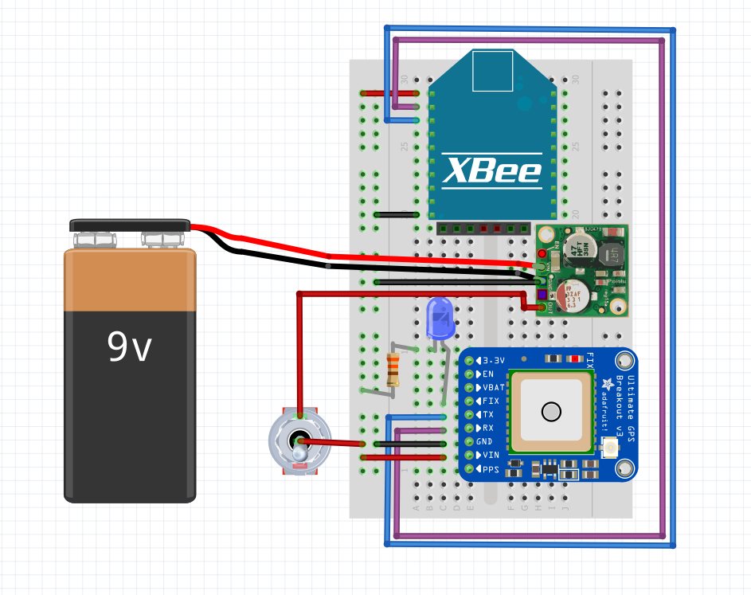

# GPS Node
Use a gps module and mDot to map locations that are within range of a LoRa gateway.

Here is the code for the Multitech mDot, You will need to configure the mDot code with your own generated security keys.
https://os.mbed.com/users/mcdocm1/code/mdotGps/

Above is the wiring diagram to make your own range mapper, please note that the mDOt has been substituted for a xBee as they both have the same pin layout.

The finished node.

Storing the sent GPS location to a csv:
<a href="mqtt_convert_and_save_gps.py">GPS location saving Pyhton script</a>

For more information on using google maps to plot GPS coordinates visit:
<a href="https://support.google.com/maps/answer/18539?co=GENIE.Platform%3DDesktop&hl=en">Google Maps Help</a>

