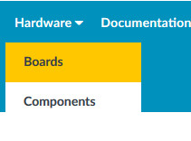
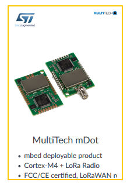
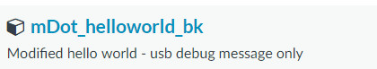
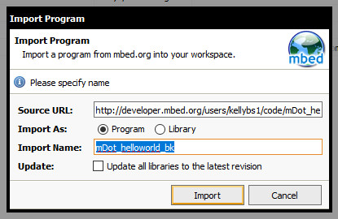
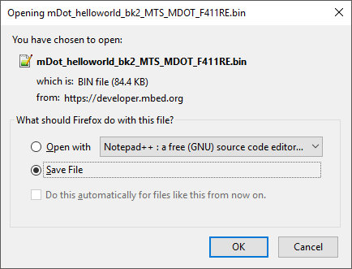
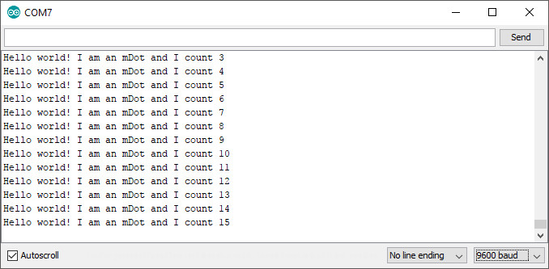

# Simplified mDotting - loading pre-made examples for DunedinIoT's mDots

Note: This should be much easier to follow than the initial "Getting Started" tutorial, as the "leg-work" has been done finding compatible version of libraries and the code was written and tested on our mDots, so I recommend starting here - BK.

## Prep

Assuming you have not already completed these steps at least once:

Create an account at <a href="https://developer.mbed.org">https://developer.mbed.org</a>

Then click Hardware -> Boards.

Filter "platform vendor" by Multitech.

Select mDot.

On the page that loads, on the right, click the "Add to your embed compiler" button.

## Importing our example program
        
For this example we're using a basic "Hello World" program that simply prints a count over the USB/Serial debug output.

Go to: <a href="https://os.mbed.com/users/kellybs1/code/mDot_helloworld_bk/">https://os.mbed.com/users/kellybs1/code/mDot_helloworld_bk/</a>

On the right of the screen, click "Import into Compiler".

In the Compiler click to import the program as a program.

Click "Compile" and download the bin file when prompted.

## Load program onto mDot

Attach the mDot to the UDK board, and attach the UDK to a PC via USB.

The mDot should appear in the pc as a flash drive would for example "MULTITECH (F:)".

Copy the binary file to this drive. The mDot might automatically restart automatically, but if it does not, press the Reset button on the UDK.

## Seeing debug info on a PC over USB

On Windows you must install serial-USB driver from here: <a href="http://www.st.com/en/embedded-software/stsw-link009.html">http://www.st.com/en/embedded-software/stsw-link009.html</a>

Open a serial terminal. I used the Arduino IDE's serial monitor set to the correct COM port (this varies depending on the machine) at 9600 baud.

If the application runs correctly and the serial monitor is configured correctly you should see debugging output.

