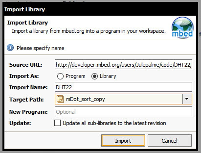
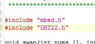

# Importing 3rd party sensor libraries

## Prep

Must already have mbed.org account set up.
If that is not done, see the Prep section of this file:
https://github.com/OtagoPolytechnic/DunedinIoT/blob/gh-pages/development/nodes/mDotHelloWorld/README.md

In the Program Workspace, Create a new program or clone an existing one.

## Importing library

Go to the webpage of the library you wish to use, eg <a href="https://developer.mbed.org/users/Julepalme/code/DHT22/">https://developer.mbed.org/users/Julepalme/code/DHT22/</a>

On the right side of screen, click "Import into Compiler"

In the compiler import popup window change the target folder to the folder of your program.
Setting "import as" should be "library". Click Import.

## Include library

You need to include the library in your source code before you can use it.
Near the top of your program's main cpp source file (usually main.cpp) file, with the other include statements add

`include "libraryName.h"`

