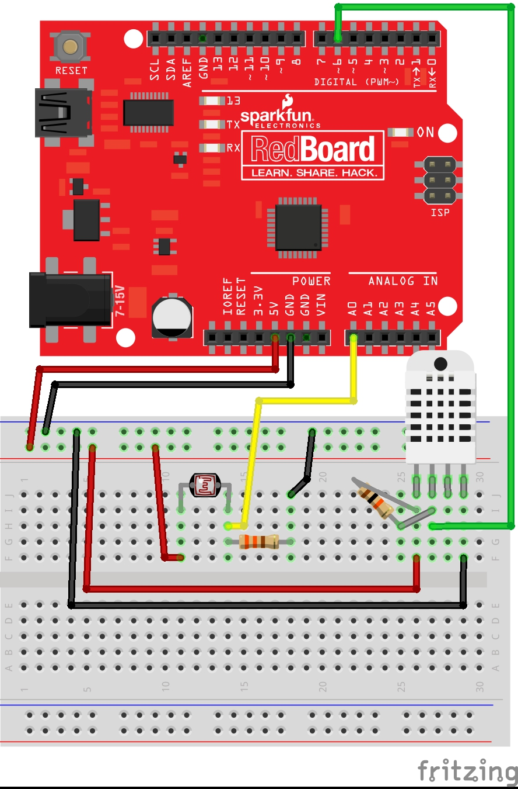
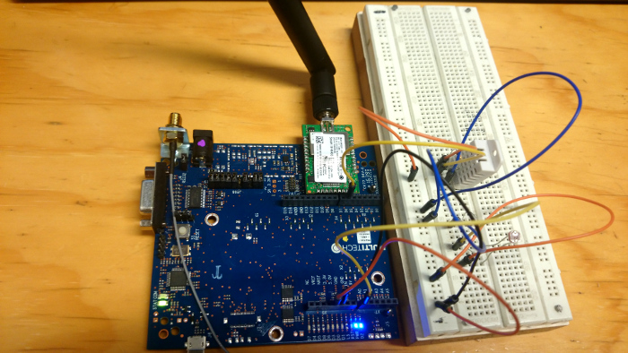
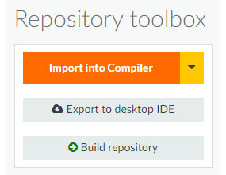
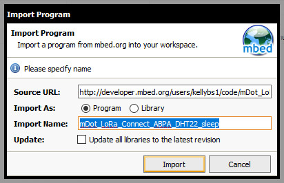
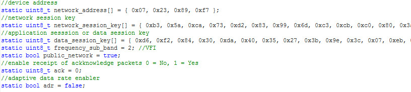
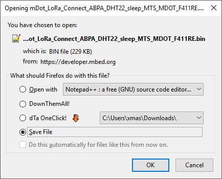

# Combining previously learned function to build a node that senses data, sends it over a LoRaWAN, and then sleeps/wakes.

## Prep

Must already have mbed.org account set up.
If that is not done, see the Prep section of this file:
https://github.com/OtagoPolytechnic/DunedinIoT/blob/gh-pages/development/nodes/mDotHelloWorld/README.md

## Required Hardware

mDot - 915
MultiTech mDot UDK board
DHT22 Sensor
10 KOhm resistor
330Ohm resistor
Standard Light Dependent Resistor

## Wiring

Using the corresponding Arduino pins on the UDK

## Importing our example program

Go to: <a href="https://developer.mbed.org/users/kellybs1/code/mDot_LoRa_Connect_ABPA_DHT22_sleep/">https://developer.mbed.org/users/kellybs1/code/mDot_LoRa_Connect_ABPA_DHT22_sleep/</a>           

On the right of the screen, click "Import into Compiler".

In the Compiler click to import the program as a program.

Near the top of the program, change the network setting values to match the settings required for your LoRaWAN.

If adaptive data rate is disabled, ie, `static bool adr = false;`

Scroll down to `dot->setTxDataRate(mDot::DR2);` and set your required data rate.

Click "Compile" and download the bin file when prompted.

## Load program onto mDot

Attach the mDot to the UDK board, and attach the UDK to a PC via USB.

The mDot should appear in the pc as a flash drive would for example "MULTITECH (F:)".

Copy the binary file to this drive. The mDot might automatically restart automatically, but if it does not, press the Reset button on the UDK.

## Seeing debug info on a PC over USB

On Windows you must install serial-USB driver from here: <a href="http://www.st.com/en/embedded-software/stsw-link009.html">http://www.st.com/en/embedded-software/stsw-link009.html</a>

Open a serial terminal. I used the Arduino IDE's serial monitor set to the correct COM port (this varies depending on the machine) at 9600 baud.

If the application runs correctly and the serial monitor is configured correctly you should see debugging output, and be receiving packets at the gateway.
