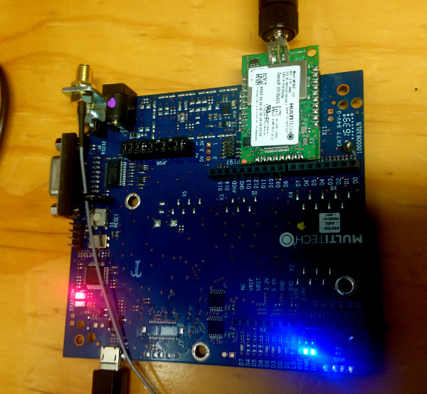
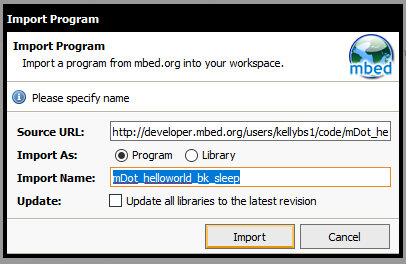
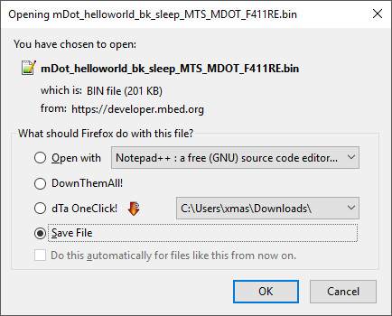

# Using the sleep function of a Multitech mDot

## Prep

Must already have mbed.org account set up.
If that is not done, see the Prep section of this file:
https://github.com/OtagoPolytechnic/DunedinIoT/blob/gh-pages/development/nodes/mDotHelloWorld/README.md

## Required Hardware

mDot - 915

MultiTech mDot UDK board

## Wiring

Attach the mDot to the UDK, and attach a 900MHz antenna to the mDot.

## Importing our example program

Go to: <a href="https://developer.mbed.org/users/kellybs1/code/mDot_helloworld_bk_sleep/">https://developer.mbed.org/users/kellybs1/code/mDot_helloworld_bk_sleep/</a>           

This program prints a message and sleep the mDot for five seconds, using a Real Time Clock (RTC) alarm to wake.   

It also prints an iterating number to show that program flow is only paused by sleep - the mDot does not restart after sleeping.

On the right of the screen, click "Import into Compiler".

In the Compiler click to import the program as a program.

Click "Compile" and download the bin file when prompted.

## Load program onto mDot

Attach the mDot to the UDK board, and attach the UDK to a PC via USB.

The mDot should appear in the pc as a flash drive would for example "MULTITECH (F:)".

Copy the binary file to this drive. The mDot might automatically restart automatically, but if it does not, press the Reset button on the UDK.

## Seeing debug info on a PC over USB

On Windows you must install serial-USB driver from here: <a href="http://www.st.com/en/embedded-software/stsw-link009.html">http://www.st.com/en/embedded-software/stsw-link009.html</a>

Open a serial terminal. I used the Arduino IDE's serial monitor set to the correct COM port (this varies depending on the machine) at 9600 baud.

If the application runs correctly and the serial monitor is configured correctly you should see debugging output.

