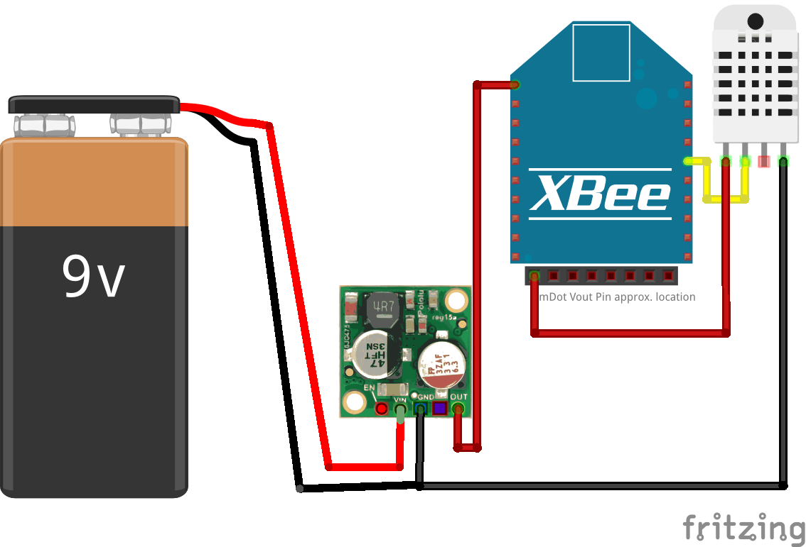

# mDot LoRaWAN-based Frost alerts via Twitter

This page provides information and diagrams for using Twitter to send alerts via a Python script that interprets LoRa information.

## Code

The basic program for the mDot is available here for importeing and modifying as your own project: 

https://os.mbed.com/users/kellybs1/code/FrostyBoySensor/

This code relies on a DHT22 sensor connected to an mDot in this fashion:

Or connected to the mDot development board with the DHT22 sensor connected to D6 on the Arduino-layout pins. (pin PA_1 on the mDot).

The Python script in available here: <a href="frostTwitterAlert.py">frostTwitterAlert.py</a>

## Process

You will need to configure the mDot code with your own generated security keys.

You will need two additiona libraries for Python.
1. python-twitter : https://python-twitter.readthedocs.io/en/latest/installation.html
2. paho-mqtt 1.1: https://pypi.python.org/pypi/paho-mqtt/1.1

You can install them via pip commands on the Command line. If you are using Windows, I recommend managing your Python installation via <a href="https://conda.io/docs/user-guide/install/windows.html">Anaconda</a> and using pip via the Anaconda Command Line tool.

For the Python script to be functional you will need to sign up a phone number to twitter and generate a series of API keys.

The process for this is already well documented in the python-twitter library documentation: <a href="https://python-twitter.readthedocs.io/en/latest/getting_started.html">https://python-twitter.readthedocs.io/en/latest/getting_started.html</a>

