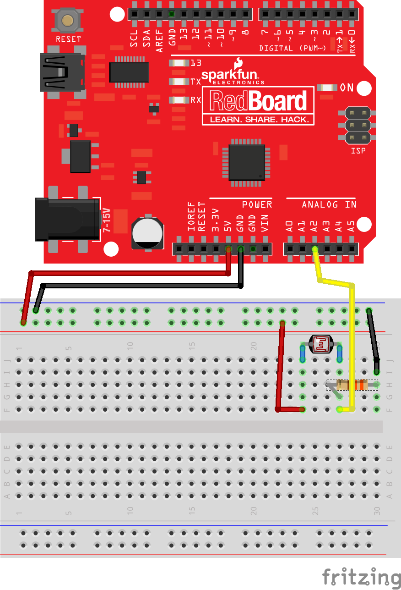

# Light Dependent Resistor with Arduino Uno

## Hardware required
1. Arduino Uno or compatible
2. Standard Light Dependent Resistor
3. 330 Ohm resistor

## Additional software libraries
None

## Wiriring

## Code

<a href ="ldrExample.ino">ldrExample.ino</a>
