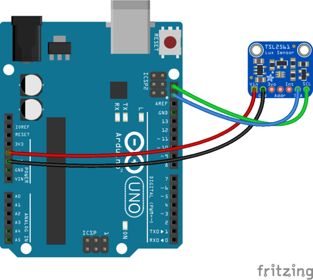

# Adafruit TSL 2561 Lux sensor with Arduino Uno

## Hardware required
1. Arduino Uno or compatible
2. Adafruit TSL 2561 Lux sensor (https://www.adafruit.com/product/439)

## Additional software libraries
1. Adafruit Unified Sensor Driver: https://github.com/kellybs1/Adafruit_Sensor
1. Adafruit TSL2561 library: https://github.com/kellybs1/Adafruit_TSL2561

## Wiring

## Code

<a href ="luxSensorExample.ino">luxSensorExample.ino</a>
