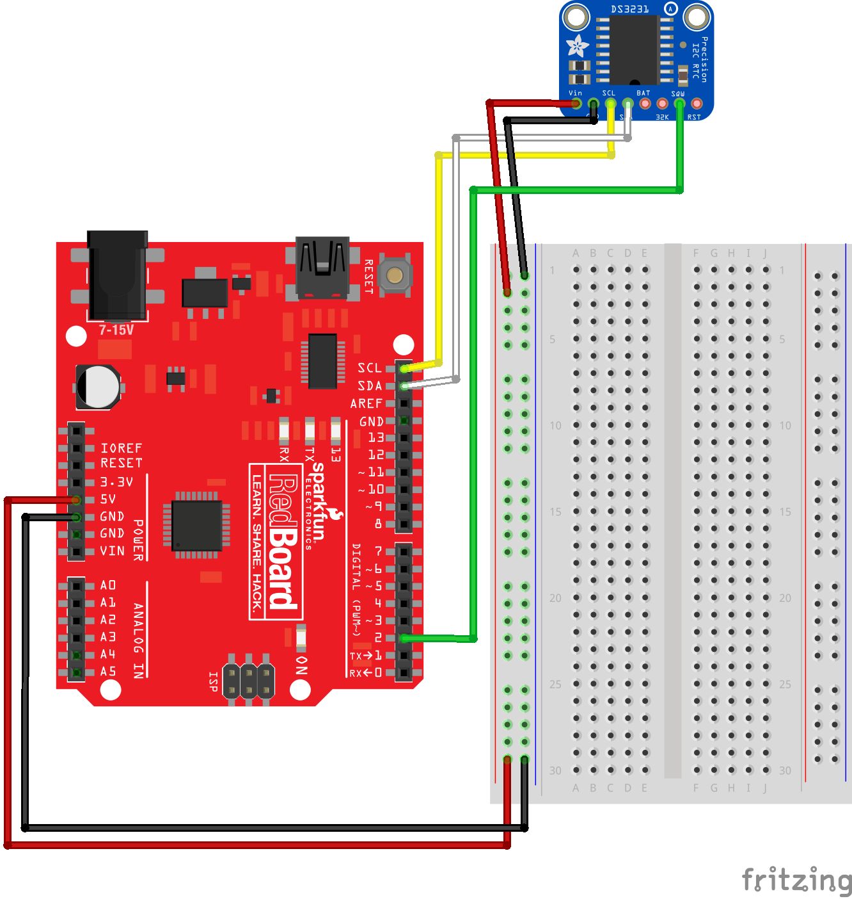

# RTC with Arduino Uno

## Hardware required
1. Arduino Uno or compatible
2. Standard DS3231 RTC

## Additional software libraries
Fabio Cuomo's DS3231 Library (https://github.com/kellybs1/FabioCuomo-DS3231)

## Wiring

## Code

<a href ="rtcDateTimeExample.ino">rtcDateTimeExample.ino</a>
