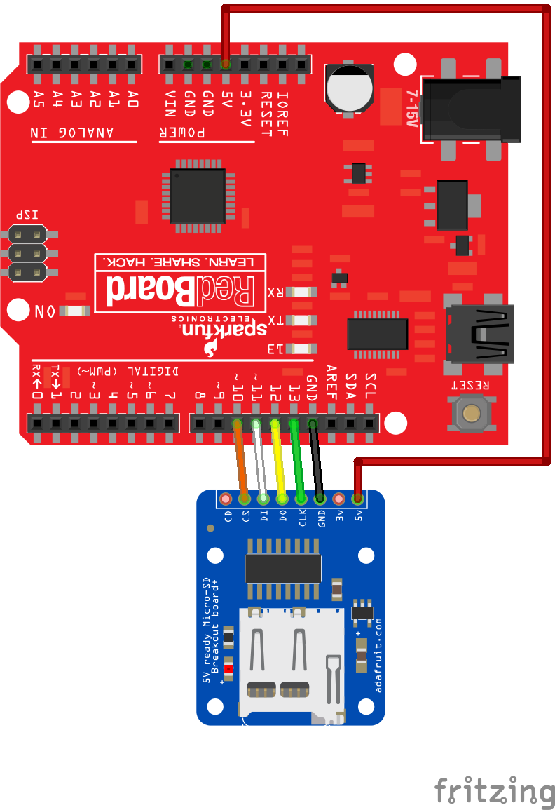

# SD card reader/writer with Arduino Uno

## Hardware required
1. Arduino Uno or compatible
2. Adafruit SD card breakout (https://www.adafruit.com/product/254)
3. Micro SD card

## Additional software libraries
None

## Wiring

## Code

<a href ="sdCardExample.ino">sdCardExample.ino</a>
