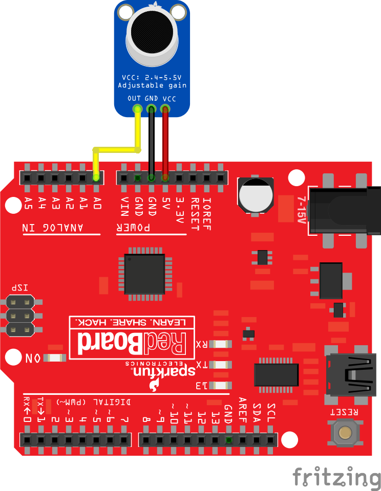

#  Sound sensor with Arduino Uno

## Hardware required
1. Arduino Uno or compatible
2. Adafruit MAX4466 microphone (https://www.adafruit.com/product/1063)

## Additional software libraries
None

## Wiring

## Code

<a href ="soundExample.ino">soundExample.ino</a>
