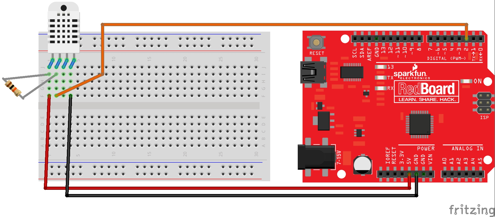

#  DHT22 Temperature/Humidity sensor with Arduino Uno

## Hardware required
1. Arduino Uno or compatible
2. DHT22 temperature/humidity sensor
3. 10KOhm resistor

## Additional software libraries
Adafruit DHT library (https://github.com/kellybs1/DHT-sensor-library)

## Wiring

## Code

<a href ="tempHumidExample.ino">tempHumidExample.ino</a>
