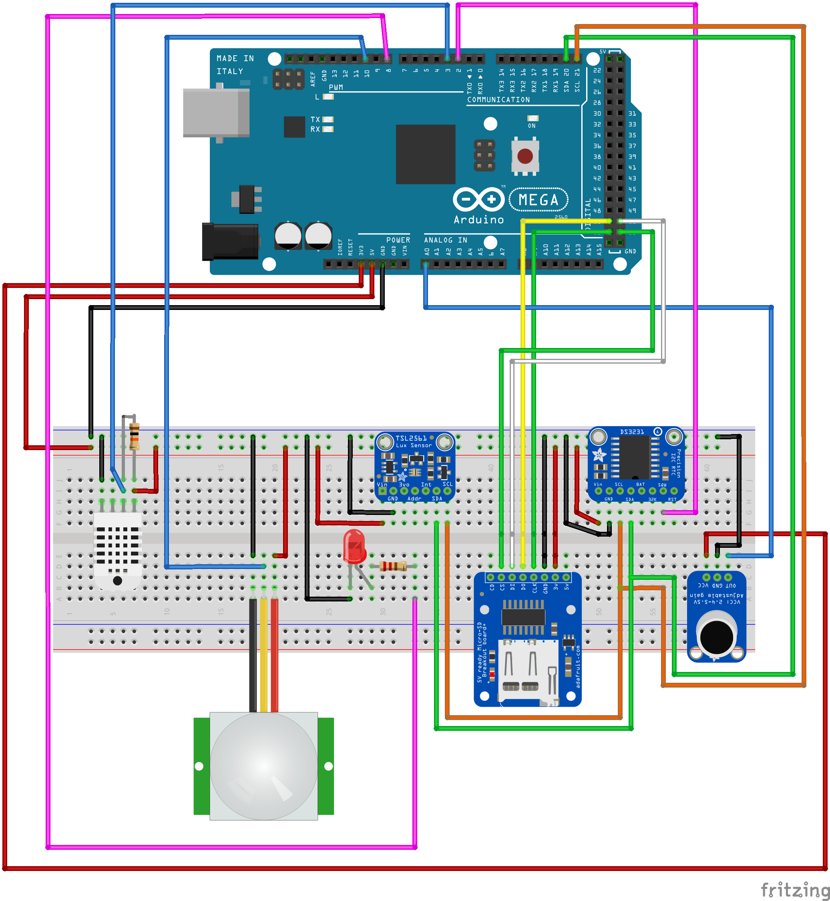

#  Room sensor data logger with Arduino Mega 2560

## Hardware required
1. Arduino Mega 2560 or compatible
2. Adafruit MAX4466 microphone (https://www.adafruit.com/product/1063)
3. Adafruit TSL 2561 Lux sensor (https://www.adafruit.com/product/439)
4. DHT22 temperature/humidity sensor
5. Standard PIR motion sensor
6. Standard DS3231 RTC
7. 330 Ohm resistor
8. 10K Ohm resistor
9. LED
10. Adafruit Micro SD breakout (https://www.adafruit.com/product/254)
11. Micro SD card

## Additional software libraries
1. Adafruit Unified Sensor Driver (https://github.com/kellybs1/Adafruit_Sensor)
2. Adafruit TSL2561 library (https://github.com/kellybs1/Adafruit_TSL2561)
3. Fabio Cuomo's DS3231 Library (https://github.com/kellybs1/FabioCuomo-DS3231)
4. rocketscream's Low Power library (https://github.com/kellybs1/Low-Power)  Please note <a href=="https://github.com/OtagoPolytechnic/ThingsNetworkDunedin/blob/gh-pages/development/roomSensor/PartExamples/rtcLEDLowPowSleep/Modifying%20Low-Power%20library%20for%20Mega%202560.md">source modifications required for Mega 2560 compatibility</a>
5. Adafruit DHT library (https://github.com/kellybs1/DHT-sensor-library)

## Wiring

## Code

<a href ="megaSensor.ino">megaSensor.ino</a>
